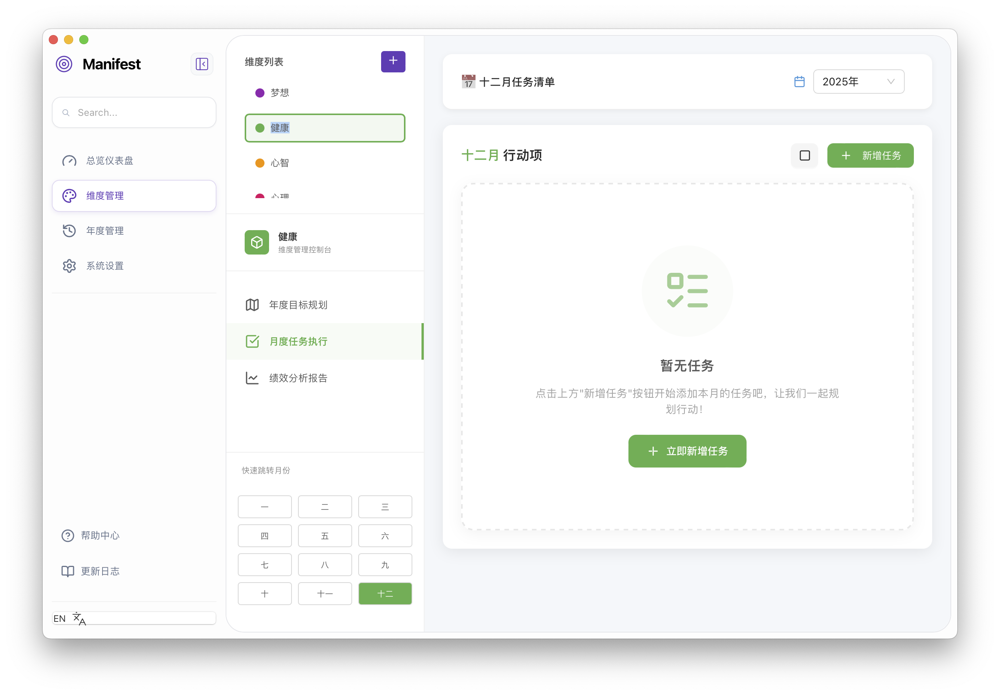

<div align="center"><h1>Manifest (WIP)</h1></div>


[](https://opensource.org/licenses/MIT)
[](https://golang.org/)
[](https://wails.io/)

Manifest是一个现代化的绩效评估工具，帮助你设定年度目标、跟踪任务进度、多维度评估绩效表现，实现高效的年度计划管理与绩效提升。

## 📖 目录

- [✨ 特性](#特性)
- [📸 效果预览](#效果预览)
- [🏗️ 架构设计](#架构设计)
- [🚀 快速上手](#快速上手)
- [⚙️ 配置](#配置)
- [📁 项目结构](#项目结构)
- [🤝 贡献](#贡献)
- [📄 许可证](#许可证)
- [📞 联系方式](#联系方式)

## ✨ 特性

- 📊 **仪表盘总览**：直观展示年度绩效得分、任务完成情况和维度进度
- 🎯 **多维度管理**：支持自定义维度配置，灵活适配不同领域的绩效评估
- 📅 **年度/季度/月度规划**：分层级管理目标与任务，实现精细化计划
- 💾 **本地数据存储**：数据安全存储在本地，保护隐私

## 📸 效果预览

<p align="center">
  
</p>
<p align="center">
  
</p>


## 🏗️ 架构设计

性能管理系统采用前后端分离的架构设计，基于 Wails 框架实现桌面应用开发：

### 技术栈

| 层次 | 技术 | 职责 |
|------|------|------|
| 前端 | React 18 + TypeScript | 用户界面、交互逻辑、数据展示 |
| 后端 | Go 1.20+ | 业务逻辑、数据存储、API 接口 |
| 框架 | Wails 2 | 桌面应用打包、前后端通信 |
| 存储 | SQLite | 本地数据持久化 |
| 样式 | CSS3 | 界面样式与响应式设计 |

### 核心模块

- **数据层**：负责数据的存储、查询和管理
- **业务层**：实现绩效评估、目标管理等核心业务逻辑
- **表现层**：提供直观的用户界面和交互体验
- **工具层**：提供通用工具函数和辅助功能

## 🚀 快速上手

### 环境要求

在开始之前，请确保您的开发环境满足以下要求：

- **Go** 1.20+ - 后端开发语言
- **Node.js** 18+ - 前端开发环境
- **npm** 9+ - Node.js 包管理器
- **Wails CLI** 2.0+ - 桌面应用开发框架

### 安装 Wails CLI

如果您还没有安装 Wails CLI，请先安装：

```bash
go install github.com/wailsapp/wails/v2/cmd/wails@latest
```

### 安装与运行

#### 1. 克隆项目

```bash
git clone <repository-url>
cd performance-wails
```

#### 2. 安装前端依赖

```bash
cd frontend
npm install
cd ..
```

#### 3. 运行开发模式

```bash
wails dev
```

开发模式下，应用会自动重载前端和后端代码的变更，方便开发调试。

#### 4. 构建生产版本

```bash
# 构建适用于当前平台的版本
wails build

# 构建指定平台的版本
wails build -platform windows/amd64
wails build -platform darwin/universal
wails build -platform linux/amd64
```

构建完成后，可执行文件将位于 `build/` 目录中。

## ⚙️ 配置

### 应用配置

项目采用直观的应用内设置界面，主要配置项包括：

- **绩效维度配置**：自定义评估维度、权重和评分规则
- **显示设置**：语言选择（中文/英文）、主题切换（明暗模式）
- **数据管理**：导入/导出绩效数据、备份恢复

### 数据存储

- **核心数据**：存储在本地 SQLite 数据库中，确保数据安全和隐私
- **用户偏好**：保存在浏览器本地存储中，提供个性化体验
- **配置文件**：应用配置信息存储在专用配置文件中

### 扩展配置

对于高级用户，可以通过修改配置文件进行更精细的调整。配置文件位于应用数据目录中，具体位置取决于操作系统：

- **Windows**: `%APPDATA%/PerformanceWails/config.json`
- **macOS**: `~/Library/Application Support/PerformanceWails/config.json`
- **Linux**: `~/.config/PerformanceWails/config.json`

## 📁 项目结构

性能管理系统采用清晰的分层架构，代码组织如下：

```
performance-wails/
├── frontend/                # 前端代码目录
│   ├── src/                # React 源代码
│   │   ├── components/     # 可复用 UI 组件
│   │   ├── pages/          # 页面级组件
│   │   ├── styles/         # 样式文件
│   │   ├── utils/          # 工具函数和业务逻辑
│   │   └── App.tsx         # 应用主入口
│   ├── wailsjs/            # Wails 生成的 Go-JS 绑定代码
│   └── package.json        # 前端依赖配置
├── img/                    # 文档截图和图片资源
├── app.go                  # 后端应用核心逻辑
├── config.go               # 配置管理模块
├── database.go             # 数据库操作和迁移
├── main.go                 # 程序主入口
├── models.go               # 数据模型定义
├── wails.json              # Wails 应用配置
└── README.md               # 项目文档
```

### 核心模块说明

- **frontend/src/components/**：包含可复用的 UI 组件，如按钮、模态框等
- **frontend/src/pages/**：包含应用的主要页面，如仪表盘、维度管理等
- **frontend/src/utils/**：包含业务逻辑和工具函数，如绩效计算、数据处理等
- **app.go**：实现与前端交互的后端 API 接口
- **database.go**：处理数据库连接、查询和事务管理
- **models.go**：定义数据结构和模型关系

## 🤝 贡献

我们非常欢迎社区贡献！无论是修复 bug、添加新功能、改进文档还是提出建议，都可以帮助我们改进项目。

### 贡献流程

1. **Fork 项目** - 创建自己的项目副本
2. **创建分支** - 为新功能或修复创建分支
   ```bash
   git checkout -b feature/AmazingFeature
   ```
3. **开发实现** - 实现功能或修复 bug
4. **测试验证** - 确保代码符合项目质量要求
5. **提交更改** - 使用清晰的提交信息
   ```bash
   git commit -m "Add some AmazingFeature"
   ```
6. **推送到远程** - 将分支推送到你的 Fork
   ```bash
   git push origin feature/AmazingFeature
   ```
7. **创建 Pull Request** - 提交贡献申请

### 开发规范

- 遵循项目的代码风格和命名约定
- 为新功能添加适当的文档和注释
- 确保所有测试通过
- 保持提交信息简洁明了

请查看 [CONTRIBUTING.md](contribution.md) 了解更多详细的贡献指南和开发规范。

## 📄 许可证

本项目采用 **MIT 许可证**，允许您自由使用、修改和分发本软件，无论是商业用途还是非商业用途。

详情请查看 [LICENSE](LICENSE) 文件。

## 📞 联系方式

如有问题、建议或合作意向，欢迎通过以下方式联系：

- **Issue Tracker**: [GitHub Issues](https://github.com/your-username/performance-wails/issues)（如果在 GitHub 上）
- **电子邮件**: your-email@example.com
- **讨论区**: 欢迎在项目讨论区提出问题和分享想法

## 🙏 致谢

感谢所有为性能管理系统做出贡献的开发者和用户！

## 🚀 开始使用

现在您已经了解了性能管理系统的核心功能和架构，开始使用它来管理您的年度目标和绩效表现吧！

如果您有任何问题或需要帮助，请随时联系我们。

---

**让我们一起打造更高效的性能管理工具！** 🎉

*Powered by Wails, React and Go*

🙏 致谢
本项目的诞生离不开以下支持：

UI/UX Design: 特别感谢 Fiona Zhou 的精美设计，她为 Manifest 提供了专业、现代且极具易用性的视觉方案，让工具不仅好用，更加好看。
